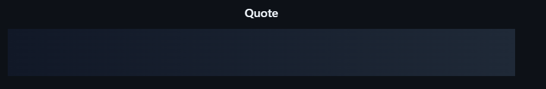

 

 

---

## ◈ About Me

I build things I find interesting, from web applications to automation tools and small experiments.
Currently focused on fullstack development, automation systems, artificial intelligence, and learning more about web security.

---

## ◈ Tech Stack

 

▸ **Frontend**

 

▸ **Backend & Databases**

 

▸ **Tools & Infrastructure**

---

## ◈ GitHub Stats

 

---

## ◈ Profile Summary

 

 

<table border="0" cellspacing="0" cellpadding="4" width="100%">
  <tr>
    <td align="center" width="50%">
      
    </td>
    <td align="center" width="50%">
      
    </td>
  </tr>
</table>

 

---

## ◈ Trophies

 

---

## ◈ Quote of the Day

 

---

## ◈ Social

Let's connect and build something interesting.

 

---

  <picture>
    <source media="(prefers-color-scheme: dark)" srcset="https://raw.githubusercontent.com/drx347/drx347/output/github-contribution-grid-snake.svg">
    <source media="(prefers-color-scheme: light)" srcset="https://raw.githubusercontent.com/drx347/drx347/output/github-contribution-grid-snake.svg">
    
  </picture>

